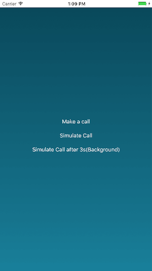

# CallKit Integration with OpenTok
A sample app to demonstrate how to integrate CallKit into OpenTok iOS SDK. This sample app is built on top of the [SpeakerBox](https://developer.apple.com/library/content/samplecode/Speakerbox/Introduction/Intro.html) app in WWDC 2016

### Install the project files

Use CocoaPods to install the project files and dependencies.

1. Install CocoaPods as described in [CocoaPods Getting Started](https://guides.cocoapods.org/using/getting-started.html#getting-started).
1. In Terminal, `cd` to your project directory and type `pod install`. (Sometimes, `pod update` is magical)
1. Reopen your project in Xcode using the new `*.xcworkspace` file.


### Configure and build the app

Configure the sample app code. Then, build and run the app.

1. The application **requires** values for **API Key**, **Session ID**, and **Token**. In the sample, you can get these values at the [OpenTok Developer Dashboard](https://dashboard.tokbox.com/). For production deployment, you must generate the **Session ID** and **Token** values using one of the [OpenTok Server SDKs](https://tokbox.com/developer/sdks/server/).

1. Replace the following empty strings with the corresponding **API Key**, **Session ID**, and **Token** values in `AppDelegate.swift`:
    ```swift
      let apiKey = ""
      let sessionId = ""
      let token = ""
    ```

1. Use Xcode to build and run the app on an iOS simulator or device.

### Exploring



  1. **Make a call**: 

The app priority will get boosted and start publishing to OpenTok platform. You won't notice any differences until you go to the home screen. Two ways to verify:
  - A badge in home screen indicating an ongoing VoIP call.
  - An incoming native phone call will not interrupt the current VoIP call, instead it shows the option menu.

  2. **Simulate a call**

An incoming call screen presents. Upon acceptance, the system will open the app. Then, the app priority gets upgraded to system level and starts publishing to OpenTok platform.

  3. **Simulate Call after 3s(Background)** (After clicking the button, please lock your cell phone to test this scenario.)

The system will wake up your cell phone with a slider bar at the bottom. Upon acceptance.
